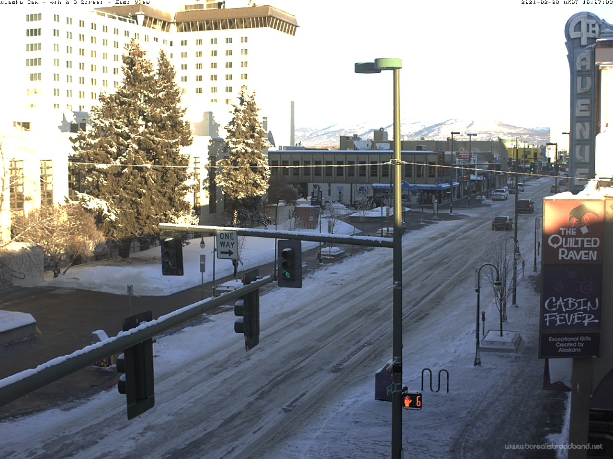
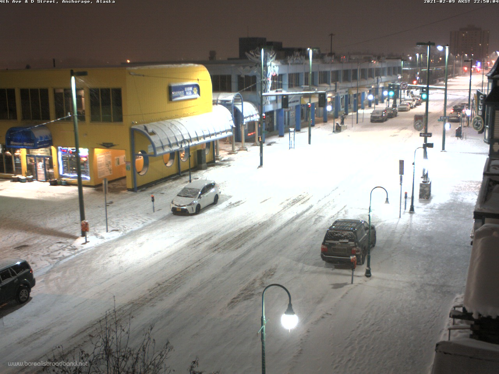
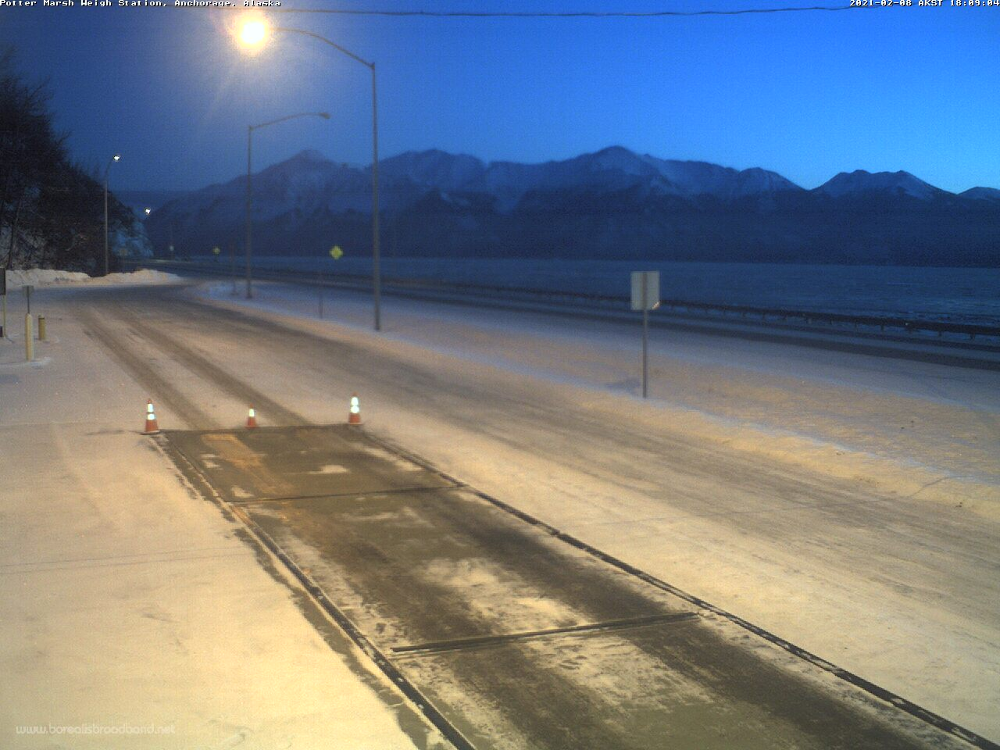
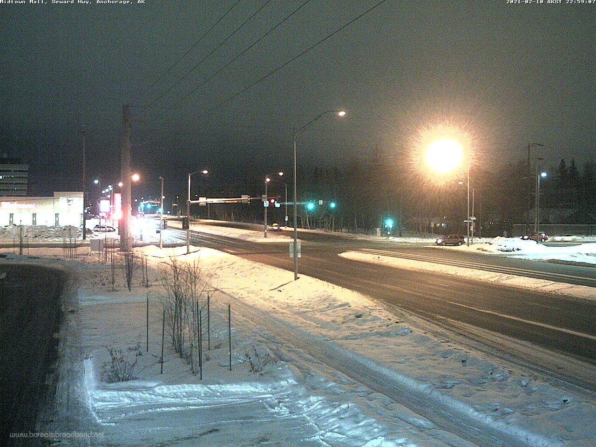
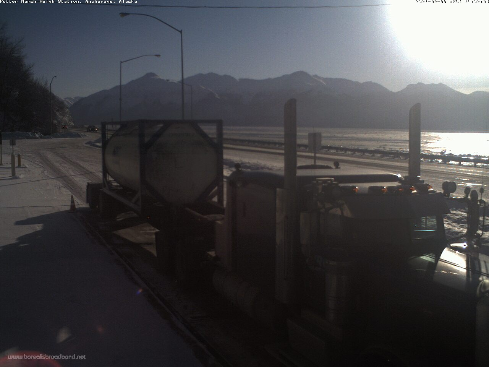
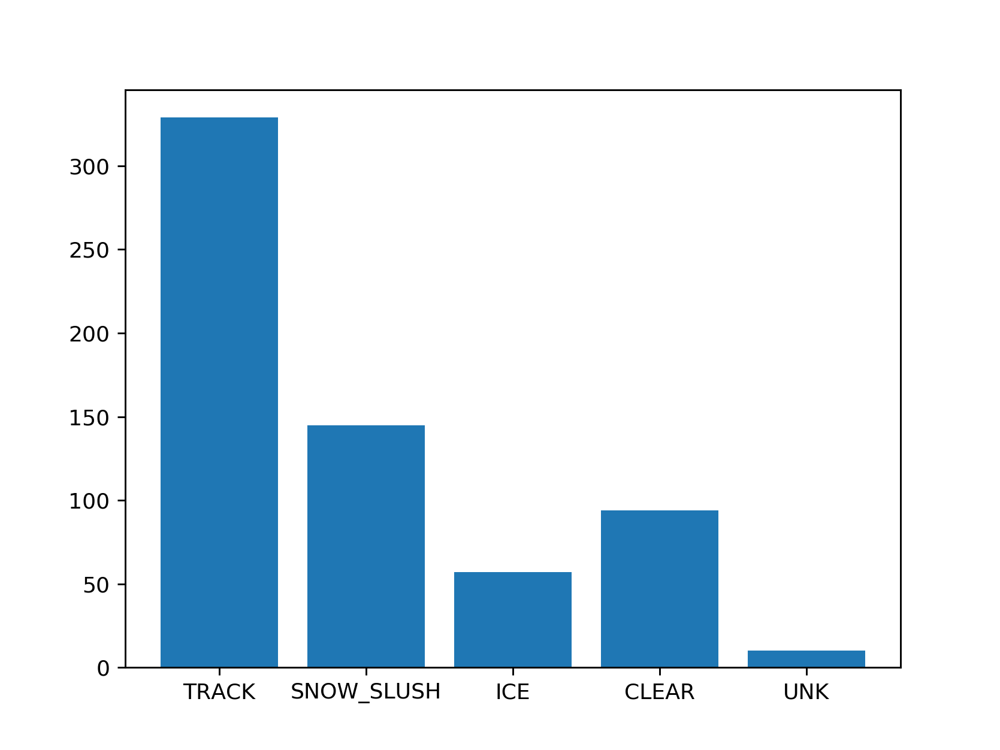
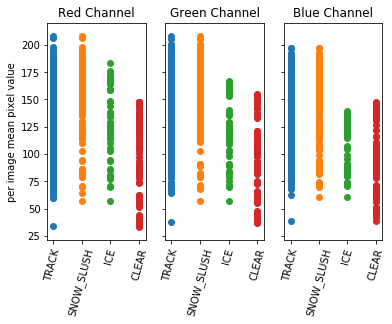
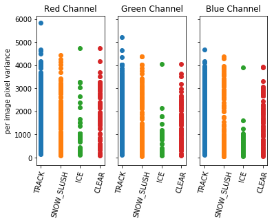

## Data

Sample image, Ship Creek Bridge (Downtown)

**Cameras**   
The data was collected from street cameras hosted by Borealis Broadband which are setup in and around Anchorge. Most of these cameras capture new images as frequently as once every five minutes. This is very useful as it means 1) a large volume of data can be scraped 2) this high temporal resolution can provide a lot of useful information e.g. how pixel values change for images of a plowed street as it begins to snow.

The images from the cameras have a resolution of 960 X 1280 pixels, where each pixel is 3 bytes (1 byte per color channel).

**Classes**  
The different classes were selected based on how easily the images could be visually categorized. For example, snow/slush are a single category because it is difficult to distinguish between the two in an image. The classes are:
1. Track - Any other condition but with clear ruts in the road that expose either pavement or black ice
2. Snow/Slush
3. Ice
4. Clear - no snow, ice, or slush. May be wet or dry.
5. Unknown - images that could not be classified. These are not used in training or analysis.

The classes are not mutually exclusive, any image may be tagged as 1 or more of the above classes.

Examples:
1. Track

2. Snow/Slush

3. Ice

5. Clear

6. Unknown

**Current data set**  
Currently there are 452 usable (not labelled as unknown) training images, but over half of them are images of roads with track. I want to assemble a training set that is equally representative of each class, so I intend to collect more images of icy and clear roads so that I can have at least 150 images per class. This task is ongoing and weather dependent.

**Fig. 1** Distribution of images by class in current working data set

## Analysis
Each image is a 3D array of pixel values, with a red, green, and blue channel. The task ahead is to use this information to make a determination for a given image based on these pixel values. To better understand how the different channels correlate with each of the classes, the mean and variance of pixel values were calculated for each image and added to the dataset (in stats.csv these columns have names like red_mean, green_var, etc.).

  
**Fig. 2** Scatter plot of the mean pixel values for each channel, grouped by class. Each point represents an image in the dataset. Since the classes are not mutually exclusive, certain images may be represented by multiple points in a given plot.

  
**Fig. 3** Scatter plot of the variance of the pixel values for each channel, grouped by class. Each point represents an image in the dataset. Since the classes are not mutually exclusive, certain images may be represented by multiple points in a given plot.
